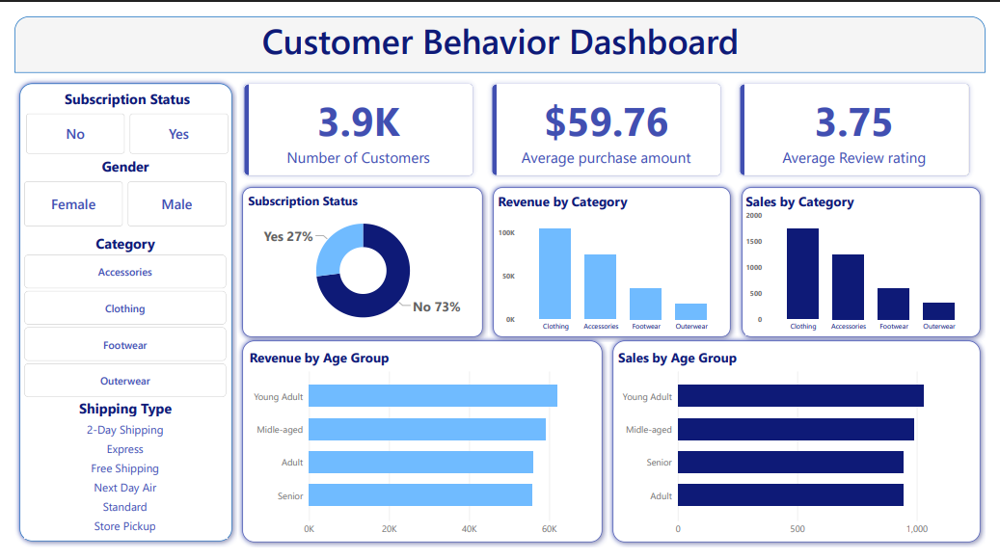

# Customer Shopping Behavior Analysis

## Project Overview
This project analyzes customer shopping behavior using **Python, MySQL, and Power BI** to uncover insights into customer purchasing patterns, subscription behavior, product performance, and revenue trends.

The project demonstrates a complete end-to-end data analytics workflow including:
- Data Cleaning using Python
- Business Analysis using MySQL
- Interactive Dashboarding using Power BI
- Business Reporting & Recommendations

---

## Business Problem

A retail company wants to better understand customer shopping behavior in order to improve:
- Customer engagement
- Product strategy
- Revenue generation
- Customer retention
- Marketing effectiveness

This project helps answer:

> "How can customer shopping data be leveraged to identify trends, improve customer engagement, and optimize marketing and product strategies?"

---

## Tools & Technologies Used

- Python (Pandas, Matplotlib)
- MySQL
- Power BI
- Jupyter Notebook
- GitHub

---

## Dataset Information

Dataset contains customer transaction and shopping behavior data including:
- Customer demographics
- Product categories
- Purchase amounts
- Subscription status
- Discounts & promo usage
- Shipping preferences
- Review ratings

### Dataset Summary
- Total Records: 3900
- Total Columns: 18

---

## Project Workflow

### 1. Data Cleaning & Preparation (Python)

Performed:
- Missing value handling
- Data type validation
- Column standardization
- Feature engineering
- Exploratory Data Analysis (EDA)

### 2. Business Analysis (MySQL)

Solved business questions such as:
- Revenue by gender
- Subscription impact on spending
- Top-rated products
- Discount-dependent products
- Customer segmentation
- Revenue by age group
- Shipping preference analysis

### 3. Dashboard Creation (Power BI)

Built an interactive Power BI dashboard containing:
- KPI Cards
- Revenue by Category
- Sales by Category
- Revenue by Age Group
- Subscription Analysis
- Interactive Filters

---

## Dashboard Preview



---

## Key Insights

- Clothing category generated the highest revenue.
- Most customers are non-subscribers.
- Young adults contribute significantly to revenue.
- Express shipping customers show slightly higher average spending.
- Loyal customers form the largest customer segment.

---

## Business Recommendations

- Promote exclusive subscription benefits
- Strengthen loyalty programs
- Optimize discount strategies
- Focus marketing on high-revenue age groups
- Highlight top-rated products in campaigns

---

## Project Structure

```text
customer-shopping-behavior-analysis/
│
├── customer_shopping_behavior.csv
├── Customer_Shopping_Behavior_Analysis.ipynb
├── customer_behavior.sql
├── Customer Behavior Dashboard.pbix
├── Customer Behavior Dashboard.pdf
├── Business_Problem_Document_Final.pdf
├── Customer_Shopping_Behavior_Project_Report.pdf
├── Customer-Shopping-Behavior-Analysis.pptx
├── dashboard_screenshot.png
└── README.md
```

---

## Files Included

| File | Description |
|------|-------------|
| `.ipynb` | Python analysis notebook |
| `.sql` | MySQL business queries |
| `.csv` | Raw dataset |
| `.pbix` | Power BI dashboard |
| `.pdf` | Dashboard export |
| `Project Report` | Complete project documentation |

---

## Future Improvements

- Customer churn prediction
- Customer segmentation using Machine Learning
- Recommendation systems
- Real-time dashboard deployment
- Predictive sales analysis

---

## Author

**Chirag Arora**

GitHub: https://github.com/CHIRAGGARORA
